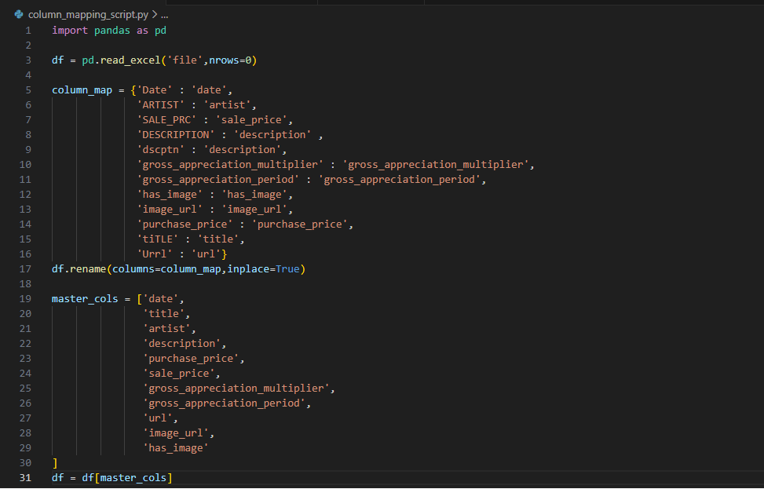
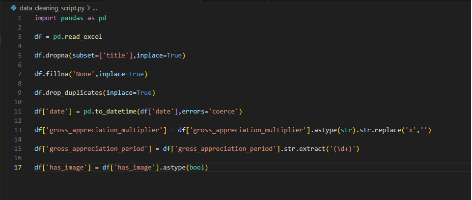
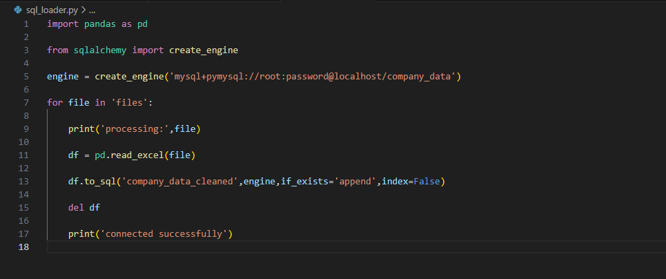
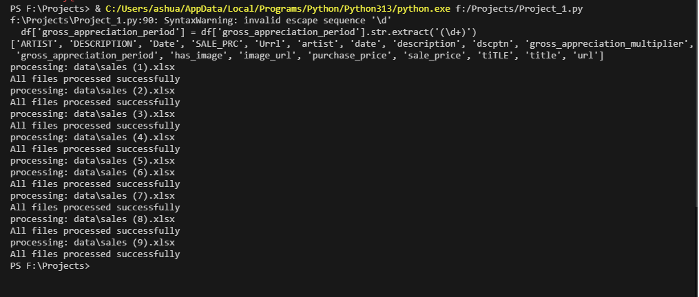
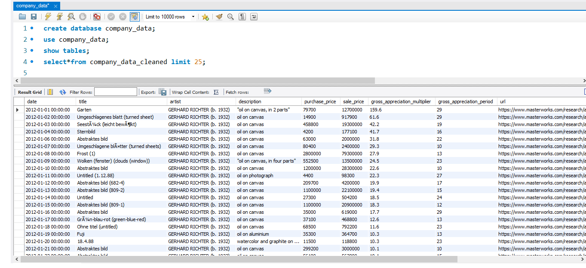
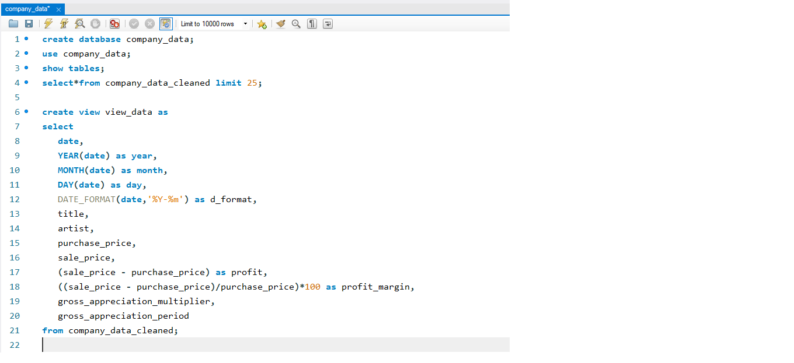
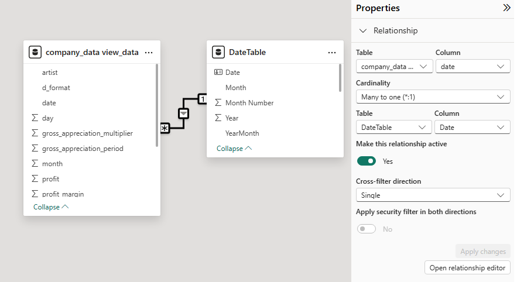
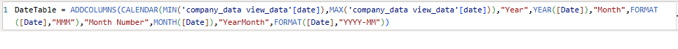
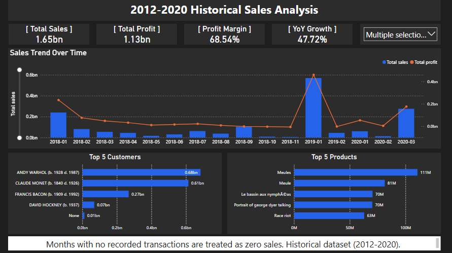
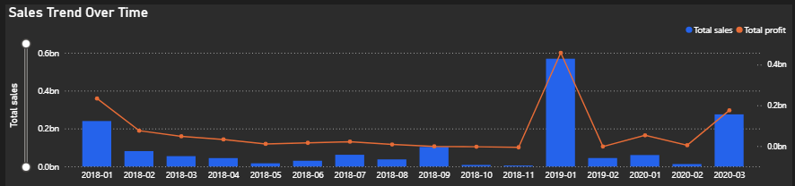

📊 End-to-End Sales Data ETL Pipeline & Analytics Dashboard   

🔷 Project Overview 

This project demonstrates an end-to-end sales data analysis workflow using Python, SQL, and Power BI.

Multiple Excel files stored across different folders were:

Programmatically scanned

Column names standardized using mapping logic

Cleaned and type-aligned

Loaded into SQL using automated loop-based processing

Merged into structured tables

Aggregated using SQL views

Connected to Power BI for KPI reporting and business analysis.  

This repository contains a demo-safe version of the automation pipeline.
Advanced business transformation logic has been modularized.  

🏗 Architecture Flow

Excel Files
→ Python ETL Automation
→ SQL Database
→ SQL Views
→ Power BI
→ Analytics Dashboard

📂 Project Structure

📸 (Screenshot 1 — Folder Structure)

Explanation below image:

The project is structured into data preparation, SQL analysis, and Power BI reporting layers to ensure separation of concerns and modular design.  

🔹 Column Mapping Logic

📸 (Screenshot 2 — Column Mapping)

Column names from multiple inconsistent Excel files were standardized using a mapping dictionary to ensure schema consistency before database loading.  

🔹 Data Cleaning & Type Alignment

📸 (Screenshot 3 — Data Cleaning)

Data cleaning steps included:

Handling missing values

Converting mixed data types

Removing invalid characters

Standardizing numeric fields

Ensuring date consistency   

🔹 Loop-Based SQL Loading

📸 (Screenshot 4 — Loop Based SQL Load)

All Excel files were processed dynamically using a loop, enabling automated ingestion of multiple files without manual intervention.  

🔹 Console Execution Output

📸 (Screenshot 5 — Console Output)

The console output confirms successful processing and loading of multiple files into SQL.   

🗄 SQL Database Layer
🔹 Final Merged Table

📸 (Screenshot 6 — Final Table)

All cleaned datasets were merged into a centralized SQL table for analytical processing.  

🔹 SQL View (Business Aggregation)

📸 (Screenshot 7 — SQL View)

A SQL view was created to:

Aggregate yearly sales

Compute profit metrics

Prepare structured data for BI consumption  

📊 Power BI Data Modeling
🔹 Data Model Relationship View

📸 (Screenshot 8 — Model View)

A proper star schema approach was implemented using a continuous Date Table to handle missing months and enable time intelligence.  

🔹 DAX Measure Example

📸 (Screenshot 9 — DAX Measure)

Key measures implemented:

Total Sales

Profit Margin

Year-over-Year Growth

Top N Analysis   

📈 Business Intelligence Dashboard
🔹 Full Dashboard

📸 (Screenshot 10 — Dashboard)

The dashboard provides an executive-level overview of business performance from 2012–2020.  

🔹 Combo Chart (Trend + Margin)

📸 (Screenshot 11 — Combo Chart)

A combo chart was used to visualize:

Monthly Sales (Column)

Profit Margin Trend (Line)  

🔹 KPI Section

📸 (Screenshot 12 — KPI Section)

KPIs displayed:

Total Sales

Total Profit

Profit Margin

Year-over-Year Growth   

📌 Key Business Insights

Sales peaked during the later years of the dataset.

Profit margin averaged approximately 68%.

Certain months showed zero recorded transactions.

Top 5 customers contributed significantly to total revenue.   

🛠 Tools & Technologies

Python (Pandas)

MySQL

Power BI

DAX

SQL Views

Data Modeling (Star Schema)   

🔎 Data Handling Note

Months with no recorded transactions were treated as zero sales using a continuous Date Table approach to ensure accurate trend visualization.  

🚀 Skills Demonstrated

Data Cleaning & Standardization

Schema Mapping

SQL Aggregation

Time Intelligence Modeling

KPI Development

Business Dashboard Design

End-to-End Data Workflow
